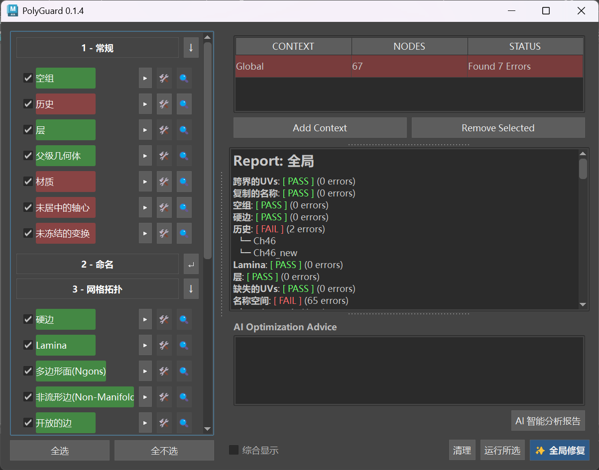

# Maya PolyGuard

一个集 **自动化检查**、**安全修复** 与 **AI 智能建议** 于一体的 Maya 美术管线工具。

 
## 🚀 核心架构与特性

- **数据驱动全量检查**：内置 26 项严格的工业级标准检查，涵盖常规、命名、拓扑与 UV 四大维度。
- **一键无损修复**：针对部分极易出错的流程提供自动化修复程序。**特别优化了蒙皮（Skinning）保护机制**，在清理历史时使用 `bakePartialHistory`，绝不破坏角色的权重和 BlendShape 数据。
- **TA Copilot**：深度接入大语言模型 (LLM)，当检测到复杂拓扑或逻辑错误时，动态生成专业级的中文优化指导与性能评估。
- **生产级底层架构**：采用数据/逻辑分离设计，核心检查逻辑完全脱离 UI 耦合。基于动态多线程调度（UI 异步刷新），确保在处理百万面级大场景时 Maya 依然保持响应。
- **跨版本兼容**：底层智能路由，无缝兼容 PySide2 (旧版 Maya) 与 PySide6 (新版 Maya 2025+)。

---

## 📋 详细检查清单 (Features List)

带有 🛠️ 标记的项目表示支持**一键自动化安全修复**。

### 1 - 常规项检查 (General)
此类检查旨在确保模型资产的干净度，防止导出到引擎后出现不可预期的错位或冗余数据。

| 检查项名称 | 英文 ID | 说明 | 可一键修复 |
| :--- | :--- | :--- |:-----:|
| **空组** | `emptyGroups` | 识别并清理不包含任何有效几何体/骨骼的空 Transform 节点 |  🛠️  |
| **历史** | `history` | 检查物体是否带有过多的非变形构造历史 |  🛠️  |
| **层** | `layers` | 检查资产是否被错误地绑定在显示层中 |  🛠️  |
| **父级几何体** | `parentGeometry` | 检查 Transform 节点的父级是否也是几何体，避免层级混乱 |       |
| **材质** | `shaders` | 检查是否使用了非默认的材质球 (initialShadingGroup) |  🛠️  |
| **未居中的轴心** | `uncenteredPivots` | 检查物体的 Pivot 坐标是否偏离了其几何边界中心 (Bounding Box) |  🛠️  |
| **未冻结的变换** | `unfrozenTransforms` | 检查并重置物体的位移、旋转和缩放数据，防止引擎内坐标错乱 |  🛠️  |

### 2 - 命名规范 (Naming)
严格把控资产命名，确保符合 AAA 级游戏引擎的命名约束。

| 检查项名称 | 英文 ID | 说明 | 可一键修复 |
| :--- | :--- | :--- | :---: |
| **复制的名称** | `duplicatedNames` | 检测场景中是否存在短名称（Short Name）相同的资产 | |
| **名称空间** | `namespaces` | 检查并剥离从外部引用导入时残留的 Namespace | 🛠️ |
| **Shape名称** | `shapeNames` | 强制统一形节点命名（Transform名称 + "Shape" 后缀） | 🛠️ |
| **数字后缀** | `trailingNumbers` | 清理 Maya 复制时自动生成的无意义数字后缀 | 🛠️ |

### 3 - 网格拓扑 (Topology)
深度扫描网格顶点与面的连接关系，将可能导致引擎渲染破面、光照错误的坏面提前揪出。

| 检查项名称 | 英文 ID | 说明 | 可一键修复 |
| :--- | :--- | :--- | :---: |
| **硬边** | `hardEdges` | 检查模型中存在的硬边连接（影响法线平滑） | |
| **Lamina** | `lamina` | 检查共用相同顶点的重叠面 (Lamina faces) | 🛠️ |
| **多边形面(Ngons)** | `ngons` | 严查超过 4 条边的多边形面，避免引擎三角化时产生破洞 | |
| **非流形边** | `noneManifoldEdges` | 检查连接了 3 个或以上面的非流形边，这是物理模拟和渲染的致命伤 | 🛠️ |
| **开放的边** | `openEdges` | 检查模型边缘未闭合的边 (边界线) | |
| **极点 (Poles)** | `poles` | 检查连接了 6 条或以上边的顶点，防止细分曲面时产生严重褶皱 | |
| **星形点 (Starlike)**| `starlike` | 检查非星形拓扑多边形 | |
| **三角面** | `triangles` | 统计模型中的三角面构成 | |
| **0面积的面** | `zeroAreaFaces` | 检查并清理面积极小（趋近于0）的废面 | 🛠️ |
| **0长度的边** | `zeroLengthEdges` | 检查并清理长度极短的废边，防止法线计算溢出 | 🛠️ |

### 4 - UV 数据 (UVs)
确保纹理贴图能够正确、无缝地映射到资产表面。

| 检查项名称 | 英文 ID | 说明 | 可一键修复 |
| :--- | :--- | :--- | :---: |
| **跨界的UVs** | `crossBorder` | 检查横跨不同 UV 象限边界的连续 UV 壳 | |
| **缺失的UVs** | `missingUVs` | 找出场景中完全没有分配 UV 坐标的面 | |
| **在边界上的UVs** | `onBorder` | 检查绝对紧贴在 UV 象限边界（0或1）上的 UV 点 | |
| **重叠的UVs** | `selfPenetratingUVs`| 检查自身发生穿插、重叠的 UV 面 | |
| **UV范围** | `uvRange` | 检查 UV 坐标是否超出了合理的 UDIM 或 0-1 象限范围 | |

---

## 💻 环境要求

- **操作系统**：Windows / macOS / Linux
- **Maya 版本**：Maya 2022 及以上版本 (推荐 2022+)。*注：理论支持 Maya 2017+，但 2022 以下版本使用 Python 2，本工具未针对 Python 2 的字符串编码（特别是中文路径）进行深度测试。*
- **依赖库**：纯 Maya 原生 API 开发，**无需额外安装 `requests` 等第三方库**。支持 PySide2 与 PySide6 的自动识别切换。

## 📦 安装与详细使用说明

本工具采用纯 Python 脚本运行，无需复杂的插件安装。请按照以下步骤操作：

### 第一步：放置文件
将下载解压后的 `PolyGuard` 文件夹放入您的 Maya 本地脚本目录：
- **Windows**: `C:\Users\<您的用户名>\Documents\maya\scripts\`
- **macOS**: `~/Library/Preferences/Autodesk/maya/scripts/`

### Step 2: 在 Maya 中启动与配置 AI
1. 启动 Maya。
2. 点击界面右下角的 `{;}` 图标，或通过顶部菜单栏 **窗口 (Windows) -> 常规编辑器 (General Editors) -> 脚本编辑器 (Script Editor)** 打开。
3. 切换到下方的 **Python** 标签页。
4. 将以下代码完整复制进去，**替换您的真实 API Key**，全选并运行（小键盘 `Enter` 或 点击蓝色播放按钮 ▶️）：

```python
import maya.cmds as cmds
import sys

# 1. 配置 AI 核心参数
# 【必填】填入你的专属 API Key
cmds.optionVar(sv=("PolyGuard_AI_KEY", "sk-xxxxxxxxxxxxxxxxxxxxxxxxxxxxxxxxxxxxxxxxxxxx"))

# 【必填】代理或官方接口地址 (确保以 /v1/chat/completions 结尾)
cmds.optionVar(sv=("PolyGuard_AI_URL", "[https://tbnx.plus7.plus/v1/chat/completions](https://tbnx.plus7.plus/v1/chat/completions)"))

# 【必填】锁定使用 gpt-4o
cmds.optionVar(sv=("PolyGuard_AI_MODEL", "gpt-4o"))

print("PolyGuard AI 核心环境变量配置与覆盖完成！")

# 2. 内存清理与插件启动
# 强制清除旧模块缓存，防止代码更新后 Maya 读取死锁
modules_to_delete = [m for m in sys.modules if m.startswith('PolyGuard')]
for m in modules_to_delete:
    del sys.modules[m]

# 导入并启动 UI 主程序
try:
    import PolyGuard.PolyGuard_UI as pgUI
    pgUI.UI.show_UI()
    print("PolyGuard 启动成功！")
except ModuleNotFoundError as e:
    cmds.error(f"启动失败！请检查文件夹命名是否严格为 'PolyGuard'，且位于正确的 scripts 目录下。详情: {e}")
